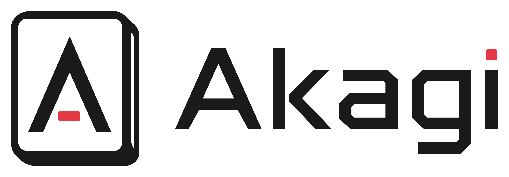

<!-- markdownlint-disable MD033 MD041 -->

<br/>

<p align="center">
  <picture>
    <source media="(prefers-color-scheme: dark)" srcset="assets/logo/akagi-logo-dark.png">
    
  </picture>
</p>

<p align="center">
  <i>「死ねば助かるのに………」 - 赤木しげる</i>
  <br/><br/>
  Real-time mahjong AI assistant for <b>Mahjong Soul</b>, <b>Tenhou</b>, and more.<br/>
  Akagi V3: A single-binary Rust + Tauri rewrite of
  <a href="https://github.com/shinkuan/Akagi/tree/v2">Akagi</a> and
  <a href="https://github.com/Xe-Persistent/Akagi-NG">AkagiNG</a>.
  <br/><br/>
  <a href="https://discord.gg/Z2wjXUK8bN">Ask anything on Discord</a>
  ·
  <a href="https://github.com/shinkuan/Akagi/issues">Report Bug</a>
  ·
  <a href="https://github.com/shinkuan/Akagi/issues">Request Feature</a>
  ·
  <a href="https://deepwiki.com/shinkuan/Akagi">DeepWiki</a>
</p>

<p align="center">
  <a href="https://github.com/shinkuan/Akagi/stargazers"></a>
  <a href="https://github.com/shinkuan/Akagi/releases"></a>
  <a href="https://github.com/shinkuan/Akagi/issues"></a>
  <a href="./LICENSE.txt"></a>
  <a href="https://github.com/shinkuan/Akagi/actions/workflows/release.yml"></a>
  <a href="https://discord.gg/Z2wjXUK8bN"></a>
  <a href="https://deepwiki.com/shinkuan/Akagi"></a>
</p>

<p align="center">
  Other branches:
</p>

<p align="center">
  <a href="https://github.com/shinkuan/Akagi/tree/v2"></a>
  <a href="https://github.com/Xe-Persistent/Akagi-NG"></a>
</p>

<p align="center">
  <b>English</b>
  ·
  <a href="./README.zh-TW.md">繁體中文</a>
  ·
  <a href="./README.zh-CN.md">简体中文</a>
</p>

---

## About

> The purpose of this project is to provide a convenient way to understand
> your performance in mahjong matches in real time and to learn from it.
> This project is intended for **educational purposes only**. The author is
> not responsible for any actions taken by users. Game developers and
> publishers reserve the right to act against users who violate their
> terms of service; any consequences (account suspension, etc.) are the
> user's responsibility.

Akagi watches your Mahjong Soul / Tenhou game over a local proxy or a
built-in browser, mirrors the game state, and shows **shanten**, **waits**,
**agari rate**, **tenpai rate**, **per-opponent deal-in risk**, and a
**recommended discard** in a draggable HUD. A built-in AI model ships inside
the app — nothing to install — and its suggestion appears each turn; point
it at the cloud inference API when you want a stronger, hosted model.

## Screenshots


https://github.com/user-attachments/assets/42812e85-ccf0-49fd-b825-adbb5b7b58b0

https://github.com/user-attachments/assets/2ce7cb71-8b25-4895-a12b-0a638665dcab

https://github.com/user-attachments/assets/d5bc6ff6-6560-4365-ae55-660c9a522790

---

## Table of Contents

**For users**
- [Features](#features)
- [Supported Platforms](#supported-platforms)
- [Quick Start](#quick-start)
- [Bots](#bots)
- [Game History](#game-history)
- [Logs &amp; Diagnostics](#logs--diagnostics)
- [Troubleshooting](#troubleshooting)
- [Roadmap](#roadmap)

**For developers**
- [Architecture](#architecture)
- [Tech Stack](#tech-stack)
- [Project Layout](#project-layout)
- [mjai Bots (plugin interface)](#mjai-bots-plugin-interface)
- [Build From Source](#build-from-source)
- [Testing](#testing)
- [Releases &amp; CI](#releases--ci)
- [Reference Materials](#reference-materials)
- [License &amp; Attribution](#license--attribution)
- [Acknowledgements](#acknowledgements)

---

## Features

- **Live HUD** — shanten, waits, agari rate, tenpai rate, per-opponent
  deal-in risk, suggested attack/defence discard. Draggable, resizable
  UI layout.
- **Two capture modes**
  - **MITM proxy** (default) — system-wide; needs a one-time CA trust.
  - **Chromium** — Akagi launches a controlled Chromium-family browser
    and intercepts WebSocket frames via the Chrome DevTools Protocol.
    Zero proxy/CA setup; just play in the launched window.
- **Two bot backends**
  - **Built-in bot** (default) — a pure-Rust neural net embedded in the
    binary. No Python, no download, no setup; it just plays, in both
    4-player and 3-player.
  - **Cloud inference** (optional) — hand each decision to a
    **hosted, stronger model**. The built-in model stays loaded as an
    automatic fallback, so an unreachable server never stalls a live
    game. Keys are bought or redeemed from inside the app.

  Per-mode routing throughout: `bot.active_4p` and `bot.active_3p` swap
  automatically based on the table's player count.
- **Game history** — every completed match is auto-recorded. The
  History tab shows a rank pie chart, a cumulative PT line chart with
  selectable scoring rules (Mahjong Soul tiers / Tenhou ranks /
  Custom uma), and detailed stats (win rate, deal-in rate, riichi rate,
  fuuro rate, ryukyoku rate, average winning / deal-in points, average
  winning turn, yakuman / nagashi-mangan counts).
- **Simple first-run setup** — language → platform → capture mode →
  CA trust / Chromium pick → bot settings → done.
- **Internationalization** — English, 日本語, 繁體中文, 简体中文.
  Live switch from Setup or Settings.
- **Sanma (3-player)** — fully supported: AI analysis, per-mode bot
  routing, history stats, 3p uma tables.
- **In-app updates** — checks for new releases on launch and on demand
  from *Settings → Updates*; one click downloads the update, applies it
  in place, and restarts. Read-only installs (e.g. AppImage) fall back
  to the release page.

## Supported Platforms

| Platform | 4-Player | 3-Player | AutoPlay |
|---|:---:|:---:|:---:|
| **Mahjong Soul (Majsoul)** | &check; | &check; | &check; |
| **Tenhou** | &check; | &check; | &check; |
| **Riichi City** | &check; | &check; | &check; |
| **Amatsuki** | (planned) | (planned) | &cross; |

---

## Quick Start

### A. Install a release

Akagi ships as a portable zip — one self-contained folder per platform.
Download the file for your OS from
[Releases](https://github.com/shinkuan/Akagi/releases), unzip anywhere
you have write permission (e.g. `~/Apps/`, Desktop), and run `akagi`
inside. Configuration, logs, history, the CA cert, and bots are all
created right next to it, so moving / backing up / uninstalling is just
moving / copying / deleting the folder.

| OS | File | Notes |
|---|---|---|
| Windows | `akagi-<version>-windows-x64.zip` | x86_64. Requires WebView2 (preinstalled on Win10 1803+ / Win11). SmartScreen will warn — *More info → Run anyway*. |
| macOS | `akagi-<version>-macos-arm64.zip` | Apple Silicon. Unsigned: run `xattr -cr <unzipped folder>` once, or right-click → *Open* the first time. |
| Linux | `akagi-<version>-linux-x64.zip` | Built on `ubuntu-22.04` (glibc 2.35+). Requires WebKit2GTK 4.1 (`apt install libwebkit2gtk-4.1-0` / `dnf install webkit2gtk4.1` / `pacman -S webkit2gtk-4.1`). |

On first launch the **Setup wizard** walks you through language,
platform, capture mode, bot settings, and CA trust (only if you choose
MITM mode). There is no bot to install — the built-in one is already there.

### B. Chromium mode (no CA trust needed)

The simplest path. After Setup, Akagi finds Chrome / Edge / Brave /
Chromium automatically and launches it with its own separate profile;
log in to Mahjong Soul and play.

Frames are intercepted via the Chrome DevTools Protocol — no system
proxy, no certificate.

### C. MITM mode

System-wide proxy with a self-signed root CA at `./ca/`:

1. Trust the certificate `./ca/akagi-ca.crt` (or `.cer` / `.pem` /
   `.der`).
2. Route the game client through `127.0.0.1:23410`.
   Health probe: `GET /ping` → `pong`.
3. On Windows, [Proxifier](https://www.proxifier.com/) is the usual
   way to redirect a specific application to the proxy.
4. **Exclude loopback from that redirection.** Send `localhost`,
   `127.0.0.1` and `::1` direct, never through Akagi.

> [!IMPORTANT]
> Step 4 is not optional. Games talk to themselves over loopback for
> internal bookkeeping, and a redirector rule that matches the game for
> *any* target host will sweep those sockets into Akagi too. Akagi refuses
> them (you will see a `refusing CONNECT to loopback` warning in the log),
> but the game may still misbehave — so exclude loopback at the source.
>
> In Proxifier: **Profile → Proxification Rules**, enable the built-in
> **Localhost** rule (Action: *Direct*) and drag it **above** your game
> rule. Order matters — Proxifier takes the first rule that matches, so a
> Localhost rule sitting below the game rule never fires.

---

## Bots

### Built-in bot (no install)

Akagi ships a **built-in, pure-Rust bot**. It's the default for both modes
(`bot.active_4p = "akagi-native"`, `bot.active_3p = "akagi-native3p"`) and
appears at the top of the **Bots** tab, always "ready".

It's a small neural net trained by behavior cloning (weights are embedded
in the binary), so its strength is **modest by design** — a sensible default,
not a top-tier engine.

### Cloud inference (built-in bot)

The built-in bot can optionally hand its decisions to a **remote inference
server** instead of running its embedded model — a stronger, hosted model
reached over the network. The embedded local model stays loaded as an automatic
**fallback**: if the server is unreachable, rate-limited, or the key is invalid,
the bot plays the local model's move so a live game never stalls.

#### Getting a cloud-inference key

Three ways:

- **Buy key** — an in-app purchase.
- **Redeem code** — turn a prepaid code into a key, or add time to the key you
  already hold.
- Ask in the [Discord server](https://discord.gg/Z2wjXUK8bN).

#### Request timeout

Each move is fetched from the server with a **request timeout** (default
**3000 ms**, adjustable in the cloud-inference settings, bounded to 500–10000 ms).
If a response doesn't arrive in time, that turn falls back to the offline local
model. Raise it to tolerate a slower server or connection; lower it to give up
sooner. Note that a riichi costs two requests (declare, then discard) within one
turn, so very high values risk overrunning the game's turn timer.

### Per-mode bots

`bot.active_4p` and `bot.active_3p` are independent. Akagi picks the
right one when the game starts, based on the table's player count.

Beyond these two backends, Akagi can also run **external mjai bots** as
subprocesses. That's an extension point for developers rather than a step
anyone needs — see [mjai Bots (plugin interface)](#mjai-bots-plugin-interface).

---

## Game History

Every cleanly-ended match (one that produced an `end_game` mjai event)
is persisted under `<config_root>/history/`:

```
<config_root>/history/
├── index.jsonl              # one GameRecord per line (ULID-keyed)
└── games/
    └── <ulid>.mjai.jsonl    # full event-stream copy
```

Mid-game disconnects leave an unfinalised buffer and are silently
dropped — only complete games make it to disk.

The frontend's **History** tab shows:

- **Rank pie chart** — 1st / 2nd / 3rd / 4th distribution
  (3 slices for sanma).
- **Cumulative PT line chart** — selectable scoring rule:
  - **Mahjong Soul**: pick `場次` (銅 / 銀 / 金 / 玉 / 王座) and
    `段位` (初心 1 星 → 魂天).
  - **Tenhou**: pick `段位` (新人 → 天鳳位 across 21 ranks).
  - **Custom**: edit the uma + dan-bonus arrays directly.
  Switching rule / dan re-renders immediately — no backend round-trip.
- **Detailed stats** — win rate, deal-in rate, riichi rate, fuuro rate,
  ryukyoku rate, average winning / deal-in points, average winning
  turn, yakuman / nagashi-mangan counts.
- **Game list** — filterable by platform / players / east-or-south /
  date. Click a row for final standings + per-game stats; the trash
  icon deletes both the index entry and the per-game `.mjai.jsonl`.

PT-rule and filter selections persist to `localStorage`. Records load
from the backend on bridge boot and stay current via the
`history-recorded` Tauri event.

See [`src/history/README.md`](./src/history/README.md) for the math,
the storage schema, and how to add a new platform / stat field /
filter dimension.

---

## Logs & Diagnostics

Per-session logs land under `<log_dir>/<YYYYMMDD-HHMMSS>/`:

```
<log_dir>/<session>/
├── all.log                       # combined tracing output
├── <target>.log                  # per-module filtered logs
├── proxy.binlog                  # raw binary WS frames
├── majsoul/<flow_id>.log         # per-WebSocket flow JSON log
├── majsoul/<flow_id>.mjai.jsonl  # per-game mjai event stream
└── inspector.jsonl               # frames seen by the Inspector
```

The frontend's **Logs** route has two tabs:

### Diagnostic

Filterable application log. Filter by level (trace / debug / info /
warn / error) and by module. Live-tail or browse past sessions; click
a row to see source location + raw structured fields. An **Open
Folder** button reveals the session directory in the OS file manager.

### Inspector

Protocol-level frame viewer. Three entry types:

- **WS Frame** — raw binary (base64-truncated) plus the bridge's
  first-pass parse.
- **MjaiEvent** — decoded events flowing to the bot.
- **BotReaction** — bot responses with the `meta` field
  (confidence / q-values / whatever the bot emits).

Frame counts show how many mjai events each WS frame produced.
Useful when debugging a bot or a bridge issue.

---

## Troubleshooting

> [!TIP]
> Reproduce the problem, then save the session folder under
> `<log_dir>/<session>/` — it has everything (app log, raw frames,
> mjai events, bot meta) needed to file a useful bug report.

- **Capture not working in MITM mode.** Make sure the CA at
  `./ca/akagi-ca.crt` is trusted in your OS store. Verify the proxy is
  running: `curl http://127.0.0.1:23410/ping` should reply `pong`.
  Check your proxy redirector (Proxifier / system proxy) is sending
  the game client to the right host:port.
- **Game hangs on the loading screen in MITM mode.** Your redirector is
  probably proxying the game's loopback traffic. Look for
  `refusing CONNECT to loopback` in the log, then exclude `localhost`,
  `127.0.0.1` and `::1` — see step 4 of the MITM setup above.
- **Capture not working in Chromium mode.** Detect did not find your
  browser. Set `capture.chromium.executable` manually in Settings or
  `config.toml`. If the launched browser starts but no frames flow,
  check that `--remote-debugging-port` was not blocked by another
  extension.
- **Reopening Akagi with the Chromium window still open.** Akagi closes
  the still-running browser and relaunches a single fresh window (it
  cannot attach a second instance to the same profile). Login is
  preserved, so Mahjong Soul reconnects to an in-progress match on
  reload. If a leftover browser refuses to close — capture stops with
  "couldn't terminate the browser already using profile …" — close it
  manually and click Restart. Running two Akagi instances against the
  same profile is unsupported.
- **Tenhou reconnected in the middle of a hand.** Tenhou's rejoin message
  is a snapshot of the table, not a replay, so Akagi cannot rebuild the
  hand in progress. It shows a "rejoined mid-hand" toast and pauses
  analysis and autoplay until the next hand starts; from there on the
  game is tracked normally. A game rejoined this way is not saved to
  History, since Akagi never saw the hands before the drop and a partial
  record would skew the statistics.
- **Bot crashed mid-game.** The Inspector tab shows the last frame the
  bot saw before dying; attach it to the bug report.
- **Wrong bot picked for a 3-player game.** Check `bot.active_3p` in
  Settings → Bot — it is independent of `bot.active_4p`.
- **Where do I get help?** [Discord](https://discord.gg/Z2wjXUK8bN)
  for chat, [GitHub Issues](https://github.com/shinkuan/Akagi/issues)
  for tracked bugs and feature requests.

---

## Roadmap

Done in alpha.8:

- [x] 3-player mahjong (sanma) — full pipeline
- [x] Tenhou bridge (observe-only)
- [x] Riichi City bridge (MITM only — native client; observe-only)
- [x] Game history persistence + History tab (rank pie / PT chart / stats)
- [x] Logs viewer (Diagnostic + Inspector tabs)
- [x] i18n: en / ja / zh-TW / zh-CN, with Setup-wizard language picker
- [x] Bot install from a GitHub release or a local ZIP file
- [x] Chromium capture mode (no CA trust needed)
- [x] **Custom themes** (frontend theming hooks)
- [x] **AutoPlay** (Mahjong Soul and Tenhou; the bot drives the table
      autonomously)

Planned:

- [ ] **Amatsuki** platform support
- [ ] **Refine Frontend** — tile layout, animations, accessibility

Detailed bug tracking lives in
[GitHub Issues](https://github.com/shinkuan/Akagi/issues).

---
---

## Architecture

Single Rust binary. Subsystems own only their bus handles, never each
other. [`src/event_bus.rs`](./src/event_bus.rs) is the single source of
truth for channel types.

```
                ┌────────────────────────┐
   Game client ─│  capture (mitm | cdp)  │── CA at ./ca (mitm only)
   WebSocket    └─────────┬──────────────┘
                          ▼
                ┌────────────────────────┐
                │  bridge::<platform>    │   wire bytes → MjaiEvent
                └─────────┬──────────────┘
                          ▼ MjaiBus
       ┌──────────────────┼──────────────────┐
       ▼                  ▼                  ▼
  game_state::tracker   bot::manager     ipc forwarder
       │                  │                  │
       ▼ PostBus          ▼ BotResponseBus   ▼ app.emit
  analysis::runner   built-in NN (in-proc) Tauri webview
       │             | cloud API
       ▼ AnalysisBus  | mjai subprocess
       └──► ipc forwarder ──► app.emit
```

[`src/lib.rs`](./src/lib.rs) wires the buses on boot. The frontend
talks to the backend over push events (`mjai-event`, `bot-response`,
`bot-status`, …) and a set of pull commands, both documented in
[`src/ipc/README.md`](./src/ipc/README.md). With AutoPlay on, the
`autoplay` manager consumes the bot's decisions and performs them
through the Chromium capture backend (CDP) — clicking the table on
Mahjong Soul, or sending the action over the game's own connection on
Tenhou, whose client protocol is plain enough to speak directly.

## Tech Stack

| Layer | Tech |
|---|---|
| Shell | [Tauri](https://tauri.app) 2 |
| Backend | Rust (edition 2021), `tokio`, `tracing`, `clap` |
| MITM | [`hudsucker`](https://crates.io/crates/hudsucker) 0.24 (`rcgen-ca`, `rustls-client`) |
| CDP capture | [`chromiumoxide`](https://crates.io/crates/chromiumoxide) 0.9 |
| Mahjong engine | [`riichienv-core`](https://github.com/smly/RiichiEnv) 0.4 |
| Built-in bot | [`candle`](https://github.com/huggingface/candle) 0.9 (pure-Rust NN inference; weights embedded) |
| Cloud inference | [`reqwest`](https://crates.io/crates/reqwest) 0.13 (rustls) |
| Protobuf | `prost` 0.14 + `prost-reflect` 0.16 |
| Frontend | [React](https://react.dev) 19, TypeScript, [Vite](https://vitejs.dev) 8 |
| Styling | [Tailwind CSS](https://tailwindcss.com) v4, [shadcn/ui](https://ui.shadcn.com) (Radix Nova preset) |
| State | [Zustand](https://github.com/pmndrs/zustand) |
| Charts | [Recharts](https://recharts.org) |
| Tile rendering | [`<mah-gen>`](https://github.com/eric200203/mahgen) Web Component |
| i18n | [react-i18next](https://react.i18next.com) |
| mjai bot runtime | `python-build-standalone` 3.12 + [`uv`](https://github.com/astral-sh/uv) (bundled per platform; plugin bots only — the built-in bot needs none of it) |

## Project Layout

```
.
├── src/
│   ├── analysis/      Shanten / waits / agari-rate / risk / discard search
│   ├── autoplay/      Bot decisions → table clicks (Mahjong Soul) or protocol frames (Tenhou), via CDP
│   ├── bot/           Bot manager: built-in bot, cloud API client, mjai subprocess runner
│   ├── bridge/        Per-platform protocol → MjaiEvent
│   │   ├── majsoul/   Mahjong Soul (liqi protobuf)
│   │   ├── riichi_city/  Riichi City (MITM only)
│   │   └── tenhou/    Tenhou (JSON tag stream, observe-only)
│   ├── capture/       Capture backends abstraction (mitm | chromium)
│   ├── config/        AppConfig (TOML) sections + resolution
│   ├── event_bus.rs   Broadcast channels between subsystems
│   ├── game_state/    riichienv-driven mirror, snapshot, mahgen view
│   ├── github/        GitHub Releases client (bot install, self-update)
│   ├── history/       Game replay storage + index
│   ├── inspector/     Frame / event / bot-reaction broadcaster
│   ├── ipc/           Tauri commands, app state, capture supervisor
│   ├── logger/        Per-session log dir + per-target file appenders
│   ├── proxy/         MITM HTTP/HTTPS/WS via hudsucker; CA at ./ca
│   ├── schema/        MjaiEvent enum + IPC payload types
│   ├── updater/       In-app self-update (check + apply)
│   └── lib.rs         Boot / wiring
├── native_bot/        Built-in bot crate: obs/action codec, candle CNN, embedded weights
├── mjai_bot/
│   └── example/       Rule-based shanten optimizer (ships in tree)
├── frontend/          React + Vite + Tailwind + shadcn UI
│   └── src/
│       ├── routes/    Overview / GameDashboard / Bots / History / Logs / Settings / Setup / InspectorView / DiagnosticView
│       ├── tiles/     Dashboard tiles (header, hands, opponents, analysis, …)
│       ├── stores/    Zustand stores, one per domain (game, bot, config, theme, …)
│       └── i18n/      en / ja / zh-TW / zh-CN
├── tests/             Integration tests
├── capabilities/      Tauri permissions
├── icons/             App icons
├── tauri.conf.json    Window + bundle config
└── Cargo.toml
```

Per-module developer guides live in each `src/*/README.md`.

## mjai Bots (plugin interface)

> Optional, and aimed at developers. The [built-in bot](#built-in-bot-no-install)
> is the default and needs none of this — you only come here to run a *different*
> engine under Akagi.

Besides its own bot, Akagi can drive any engine that speaks the **mjai**
protocol. Such a bot is a standalone subprocess talking JSONL over stdin/stdout:
Akagi feeds it the game as mjai events, and it replies with an action plus
optional HUD data.

### Write one

The full guide lives in **[`mjai_bot/README.md`](./mjai_bot/README.md)**: the
I/O protocol, the mjai event stream, the reaction and `meta` HUD format, toast
notifications, and `manifest.toml` settings.
[`mjai_bot/example/`](./mjai_bot/example/) is a working rule-based bot you can
copy.

For local development, drop your bot folder under `mjai_bot/<name>/` and click
**Install environment** on its row in the **Bots** tab to build its venv — no
need to repackage and reinstall on every change. The activation toggle stays
disabled until the environment is ready.

### Install one

The **Bots** tab installs a bot from a GitHub release or a local ZIP.

The IPC command `install_bot_from_github(repo, asset_glob?, name?)` fetches the
latest release zip, extracts it under `mjai_bot/<name>/`, validates `bot.py`,
and runs `uv sync` once. Subsequent launches are fast — the sync is gated by a
stamp at `mjai_bot/<name>/.akagi/synced.stamp`.

**Install from ZIP** is the offline equivalent: click **Browse…** to pick a
`.zip` (or paste its path). It runs the exact same extract / validate /
`uv sync` pipeline; your source `.zip` is left untouched.

### AGPL boundary

Bots run as a **separate OS subprocess** spawned by Akagi. Communication is
strictly JSONL over stdin / stdout — no in-process linking, no shared address
space, no FFI. This is an intentional license boundary: an AGPL-licensed bot
(e.g. Mortal, which links libriichi) stays inside its own process, so dropping
it under `mjai_bot/<name>/` does **not** make Akagi a derived work of the bot.

## Build From Source

**Prerequisites**

- Rust (latest stable, 1.80+)
- Node.js 20+ and npm
- Tauri 2 system deps:
  - **Linux**: `libwebkit2gtk-4.1-dev`, `libgtk-3-dev`,
    `libayatana-appindicator3-dev`, `librsvg2-dev`,
    `protobuf-compiler`
  - **macOS**: Xcode Command Line Tools
  - **Windows**: WebView2 (preinstalled on Windows 11)

**Run / build**

```bash
# Debug — launches the GUI; Vite dev-server proxied by Tauri
cargo run

# Pass a custom config path
cargo run -- --config ./my-config.toml

# Build a portable zip for the current target
cargo install tauri-cli --locked          # if not already installed
bash scripts/fetch-runtime.sh             # populate runtime/<triple>/
cargo tauri build --no-bundle             # writes target/<triple>/release/akagi
bash scripts/package-zip.sh <target-triple>
# → dist/akagi-<version>-<os>-<arch>.zip

# Frontend dev only (Vite on :1420)
cd frontend && npm ci && npm run dev
```

**Bundled runtime**

`scripts/fetch-runtime.sh <target-triple>` downloads
`python-build-standalone` 3.12 + `uv` for the target and stages them
under `runtime/`. `scripts/package-zip.sh` then copies that tree next
to the binary inside the zip; `src/bot/runtime.rs` finds it
exe-adjacent at runtime, so the shipped app works without a system
Python install.

## Testing

Integration tests live in [`tests/`](./tests/):

| File | Covers |
|---|---|
| `analysis_pipeline.rs` | End-to-end analysis (events → shanten → discard recommendation) |
| `analysis_bench.rs` | Hot-path performance |
| `bot_lifecycle.rs` | Install → sync → spawn → roundtrip |
| `example_bot.rs` | Rule-based reference bot driving a synthetic game |
| `mortal_zip_layout.rs` | Validates the Mortal release-zip layout |

```bash
cargo test               # all tests, incl. integration
cargo test --release     # for the perf bench
```

## Releases & CI

GitHub Actions [`release.yml`](./.github/workflows/release.yml) builds
on tag push (`v3.*`) or manual dispatch. One portable zip per target:

| OS runner | Target | Artifact |
|---|---|---|
| `ubuntu-22.04` (glibc 2.35) | `x86_64-unknown-linux-gnu` | `akagi-<version>-linux-x64.zip` |
| `macos-14` | `aarch64-apple-darwin` | `akagi-<version>-macos-arm64.zip` |
| `windows-latest` | `x86_64-pc-windows-msvc` | `akagi-<version>-windows-x64.zip` |

Repository admins can build the current head commit of an open PR by posting
an exact `/build-artifacts` comment on that PR. The
[`pr-build.yml`](./.github/workflows/pr-build.yml) workflow replies with links
to the three portable artifacts when the build finishes; artifacts are retained
for 14 days. Comments from users without repository admin permission are
ignored.

Each zip ships `python-build-standalone` 3.12 + `uv` next to the
binary, so bots run without a system Python install.

Tags must be on the `v3` branch.

## Reference Materials

| Source | Used in | What for |
|---|---|---|
| [mjai JSONL spec (Gimite)](https://gimite.net/pukiwiki/index.php?Mjai%20%E9%BA%BB%E9%9B%80AI%E5%AF%BE%E6%88%A6%E3%82%B5%E3%83%BC%E3%83%90) | `src/schema/mjai/` | `MjaiEvent` enum + bot wire contract — 15 event types, tile-string format, state-machine rules. |
| [`EndlessCheng/mahjong-helper`](https://github.com/EndlessCheng/mahjong-helper) (Go analysis CLI) | `src/analysis/` | Direct Rust port of `util/` — shanten, waits, agari-rate, tenpai-rate, risk model, discard search. |
| [`Xerxes-2/MajsoulMax-rs`](https://github.com/Xerxes-2/MajsoulMax-rs) (Rust MITM proxy, **GPL-3.0**) | `src/proxy/handler.rs`, `src/bridge/majsoul/parser.rs`, `src/bridge/majsoul/proto/liqi.proto` | Reference for the 5-layer Mahjong Soul WS wire format (type byte → Wrapper → inner message → action protobuf). **Format only — no code copied.** |
| [`smly/RiichiEnv`](https://github.com/smly/RiichiEnv) (Rust RL env w/ Python bindings) | `Cargo.toml` (`riichienv-core` dep), `src/analysis/`, `src/game_state/` | Tile / hand / shanten / yaku / score primitives + game-state model. The analysis engine and game tracker are built on this. |
| [`eric200203/mahgen`](https://github.com/eric200203/mahgen) (mahjong-tile rendering DSL) | `src/game_state/mahgen_view.rs`, frontend `<mah-gen>` | DSL syntax for pre-encoding hand / meld / river strings backend-side. |
| [`smly/mjai.app`](https://github.com/smly/mjai.app) (mahjong AI competition platform) | `mjai_bot/`, `src/bot/` | Bot subprocess convention — JSONL stdin/stdout, argv `python bot.py <player_id>`, `AKAGI_PLAYER_ID` env, end-of-batch flush points. |
| [`shinkuan/Akagi`](https://github.com/shinkuan/Akagi/tree/v2) | Architecture / behaviour parity | The original feature set we are reproducing: MITM proxy, mjai bridge, pluggable bots, recommendation HUD. |

## License & Attribution

Akagi v3 is licensed under the [Apache License 2.0](./LICENSE.txt).
Copyright 2026 Shinkuan. Third-party attributions live in
[`NOTICE`](./NOTICE) — read it alongside the license. Per
Apache-2.0 §4(d), redistributions must include both files.

**Bundled / linked sources**

- **mahjong-helper** (MIT) — `src/analysis/` is a Rust port of `util/`.
- **riichienv-core** / RiichiEnv (Apache-2.0) — Cargo dependency.
- **mahgen** (MIT) — DSL + `<mah-gen>` custom element.

**Reference-only** (no code copied; listed in `NOTICE` for credit)

- **MajsoulMax-rs** (GPL-3.0) — Mahjong Soul WS wire format reference only.
- **mjai spec** (Gimite) — bot wire contract.
- **mjai.app** — bot subprocess convention.

## Acknowledgements

- [Akagi](https://github.com/shinkuan/Akagi/tree/v2) (Python, v2) and
  [AkagiNG](https://github.com/Xe-Persistent/Akagi-NG) (Electron + Python) —
  the predecessors this v3 is built on.
- [`mjai.app`](https://github.com/smly/mjai.app) and the mjai
  specification by Gimite — the protocol that makes pluggable bots
  possible.
- The community on [Discord](https://discord.gg/Z2wjXUK8bN) for bug
  reports, model contributions, and feedback.
